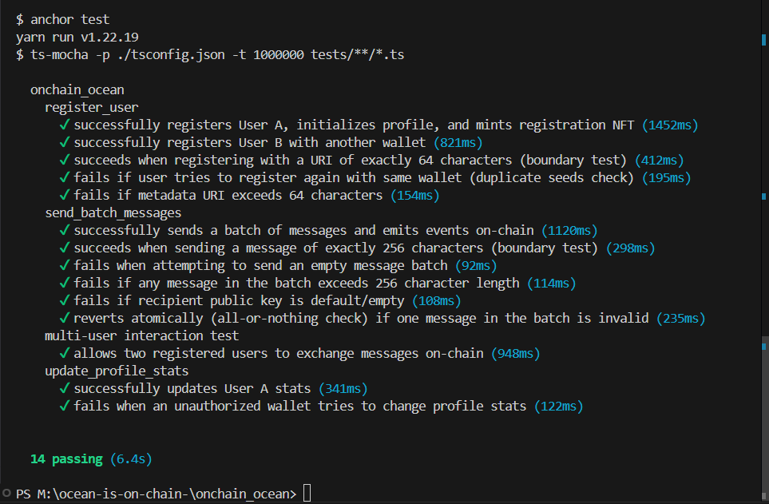

# Onchain Ocean

Onchain Ocean is a futuristic, Atlantis-inspired underwater 3D metropolis built on top of live Solana blockchain telemetry. It allows users to visualize wallet data, explore transaction patterns, interact directly via on-chain messaging, and view blockchain activities materialized as immersive architectural structures.

---

## 🌊 Core Features

### 🏛️ The Living 3D Metropolis
* **Dynamic Architectural Generation**: Wallets are represented as unique 3D structures on the ocean floor. The physical scale, floor height, window luminescence, and structure styles are procedurally generated using real-world wallet statistics (SOL balance, transaction volume, and active age).
* **Immersive Exploration**: Fly through the oceanic grid, dive into abyssal trenches, and navigate using interactive WASD or drag-and-drop Orbit controls.
* **Bioluminescent Traffic Routes**: Live on-chain transactions are represented as glowing, multi-colored drone streams moving between structures. Drones visually trace real-world wallet relationships and token routing.
* **Curated Visual Themes**: Switch between multiple lighting modes including *Abyssal*, *Bioluminescent*, *Reef Sunrise*, and *Neon Depths* to customize the atmosphere of the ocean floor.

### 🔍 Sonar Navigation & Search
* **Domain Resolution**: Integrates with the Solana Name Service (SNS) to resolve `.sol` domains directly to public keys.
* **Target Focus**: Searching any wallet address or `.sol` domain triggers a cinematic camera pan that framing the target structure in the ocean, showing its details in the side HUD.
* **Detailed Analytics Panel**: Open the right inspection panel to review live wallet balance, historical transaction timeline, protocol usage metrics, and community memberships.

### 🏢 Architectural Typologies
Structures are categorized based on the wallet's on-chain activity:
* **Wallet Tower Campus**: Skyscraper complexes featuring observation decks, skybridges, and glowing crystal energy cores.
* **Protocol HQ Complex**: Geodesic dome structures, corporate office wings, and signal arrays for protocols with high activity.
* **Community Civic District**: Circular transit rings, public halls, and residential zones representing collective DAOs or community wallets.
* **Social Campus**: Elevated platform networks and hanging gardens for social or creator wallets.
* **Infrastructure Megaplex**: Research complexes, signal antennas, and observatory domes reflecting developers and smart contract creators.

---

## ⚙️ Smart Contract Functionalities

The **Onchain Ocean** program is written in Rust using the Anchor framework, space-optimized, and configured for easy deployment on **Solana Playground** (Solpg).

* **Program ID**: `BfZLHQYYggHG3gyiEU4Yd8yFxpSdQM6Tyat7QcX6z8nf`
* **Network**: Devnet / Localnet
* **Smart Contract Source**: [`lib.rs`](./onchain_ocean/programs/onchain_ocean/src/lib.rs)
* **Anchor IDL File**: [`onchain_ocean.json`](./onchain_ocean/target/idl/onchain_ocean.json)
* **TypeScript Types**: [`onchain_ocean.ts`](./onchain_ocean/target/types/onchain_ocean.ts)

### Key Program Instructions

#### 1. User Registration & NFT Minting (`register_user`)
When a wallet registers on the platform for the first time, the program:
* Initializes a `UserProfile` PDA (`[b"user-profile", wallet]`).
* Mints exactly **1** unique registration NFT to the user's Associated Token Account (ATA).
* Revokes the mint and freeze authorities of the NFT on-chain, capping its supply permanently at 1.
* Stores starting statistics and metadata link on-chain.

#### 2. Daily Batch Messaging (`send_batch_messages`)
To allow direct wallet-to-wallet conversations without signing endless transactions, the system buffers messages locally:
* At the end of the day, the user signs **exactly one transaction** containing all messages.
* The program processes the vector of messages, updates the sender's message count and timestamp, and emits a `MessageSent` event log for each message.
* Emitting logs writes the chat history directly into the Solana transaction ledger, eliminating costly state account rent.

#### 3. Dynamic Profile Stats Sync (`update_profile_stats`)
* Enables the wallet owner to write transaction metrics (`transaction_count`, `contract_types` bitmask, and an off-chain API metadata URI) verified by Solana indexers/APIs directly into their profile.
* This allows the frontend to group and filter users who interact with the "same kind of smart contract" or have similar on-chain transactions.

---

## 🧪 Test Suite Verification

A robust suite of **14 test cases** was written in TypeScript covering boundary conditions, limit checks, error cases, transaction atomicity, and multi-user interactions.

### Test Coverage Summary
* **Registration**: Successful account creation, NFT mint verification, duplicate registration block, and metadata URI length limits.
* **Batch Messaging**: Successful batch emissions, empty vector block, length validations (256-char limits), default public key recipient rejection, and **all-or-nothing atomicity rollback checks**.
* **Integrations**: Multi-user messages back-and-forth and unauthorized stat updates.

Below is the execution log proving all 14 tests pass successfully on the local Solana validator:



---

## 🚀 Getting Started

### 🖥️ Running the Frontend App
1. Navigate to the app directory:
   ```bash
   cd onchain_ocean/app
   ```
2. Install dependencies:
   ```bash
   npm install
   ```
3. Run the local development server:
   ```bash
   npm run dev
   ```

### 🛠️ Deploying the Smart Contract
1. Open **[Solana Playground](https://solpg.io/)** in your browser.
2. Create a new **Anchor (Rust)** project named `onchain_ocean`.
3. Copy the code from [`lib.rs`](./onchain_ocean/programs/onchain_ocean/src/lib.rs) and paste it into Solpg's editor.
4. Run `build` and `deploy` in the Solana Playground terminal.
