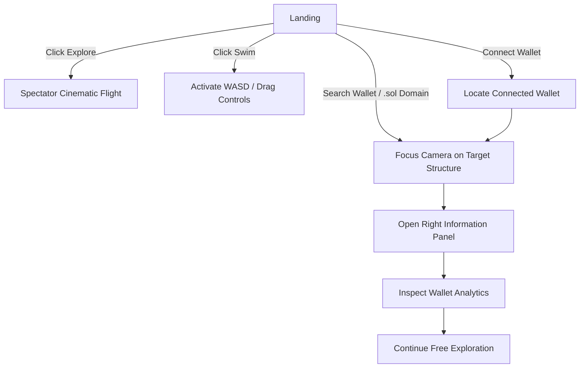

## Navigation Flow

###Overview

Onchain Ocean is a futuristic Atlantis-inspired underwater civilization built on top of real Solana blockchain data.

Users can connect wallets, search .sol domains or wallet addresses, and explore blockchain activity as architectural structures inside a living 3D ocean world.

Completed Features ✅
Wallet & Blockchain Integration
Phantom Wallet integration
Solflare Wallet integration
Wallet connection flow
Real Solana RPC integration
Real wallet balance fetching
Real transaction count retrieval
Wallet age estimation
Transaction history timeline
Protocol interaction detection
Connected wallet relationships
Solana Name Service (.sol) resolution
Reverse wallet lookup support
Search & Navigation
Search by wallet address
Search by .sol domain
Dynamic structure generation
Camera focus on searched wallets
Structure selection system
Wallet detail inspection panel
Information Panels
Right Information Panel

Displays:

Wallet information
SOL balance
Transaction statistics
Protocol interactions
Community affiliations
Activity timeline
Connected structures
3D World
Ocean Environment
Underwater exploration world
Ocean fog system
Atmospheric lighting
Ocean floor environment
Exploration camera controls
Traffic System
Bioluminescent transaction drones
Dynamic traffic movement
Multi-colored transaction routes
Architecture Upgrades ✅
Interactive Structure Families
Wallet Tower Campus

Formerly: Basic Spire

Now includes:

Multi-level skyscraper
Helix cage
Observation decks
Side buildings
Skybridges
Crystal energy core
Protocol HQ Complex

Formerly: Basic Rig

Now includes:

Corporate headquarters
Office wings
Glass atriums
Geodesic dome
Signal towers
Internal courtyards
Community Civic District

Formerly: Basic Citadel

Now includes:

Civic plaza
Community hall
Residential districts
Biodome
Circular transit ring
Crystal heart core
Social Campus

Formerly: Community Cluster

Now includes:

Elevated platform system
Social hall
Connected buildings
Glass corridor network
Hanging gardens
Infrastructure Megaplex

Formerly: Research Station

Now includes:

Research complex
Observatory dome
Analysis wing
Data tower
Signal arrays
Glass transit corridors
Landmark Architecture ✅
Genesis Citadel

Central capital city landmark featuring:

Multi-tier platforms
Crystal energy core
Orbit rings
Observation districts
Light beacon
Aether Pillar

Ancient megastructure featuring:

95-unit vertical tower
Floating crystals
Triple orbit rings
Crown apex
Helios Tower

Futuristic luxury complex featuring:

Central skyscraper
Satellite towers
Glass skybridges
Reactor dome
Skyline & Metropolis ✅
District System
Core Reef
Cyan / White district
DeFi Trench
Violet / Magenta district
Social Shelf
Gold / Turquoise district
City Features
Multi-layer skyline
Biodome cities
Elevated platform districts
Transit corridors
Dense city horizon
District lighting zones
Exploration UX ✅
Hero Camera System

Custom camera framing for:

Wallet Campuses
Protocol HQs
Community Districts
Research Complexes
Blockchain Landmarks
Exploration Flow
Search → Focus → Explore
ESC closes info panel
ESC exits focus mode
Free-swim continues from current location
No forced return to lobby
Technical Status ✅
Verified
Build compiles successfully
TypeScript validation passes
Wallet integrations functional
Search system functional
Camera system functional
Structure interactions functional
Remaining Work 🚧
Stage 6 — Visual Polish
Lighting Improvements
Better architectural visibility
Stronger building highlights
Improved emissive lighting
Better contrast
Atmosphere Improvements
Enhanced underwater fog
Better color grading
Stronger volumetric effects
Improved depth perception
Living Ocean

Planned:

Large jellyfish schools
Fish schools
Manta rays
Whale silhouettes
Ambient marine ecosystems
Effects

Planned:

God rays
Volumetric light shafts
Bloom improvements
Bubble systems
Ocean current effects
Bioluminescent particle clouds
Stage 7 — Final Visual Refinement
Reference Image Matching

Current state:

Functional underwater blockchain city

Target state:

Premium cinematic Atlantis metropolis

Focus areas:

Camera composition polish
Material quality improvements
Lighting refinement
Environmental storytelling
Increased visual impact
Current Project Status
Backend & Features

90–95% Complete

Core Product Functionality

95% Complete

Visual Experience

70–75% Complete

Final Polish Remaining

Lighting + Atmosphere + Marine Life + Cinematic Presentation

Current Goal

Transform the existing functional blockchain civilization into a visually stunning, cinematic Atlantis-scale underwater metropolis while preserving all completed wallet, search, telemetry, and exploration systems. 🌊🏙️✨

# Onchain Ocean - Progress Summary

## What We Have Completed ✅

- Phantom & Solflare Wallet Connect
- Real Solana Wallet Data Integration
- .sol Domain Search
- Wallet Info Panel (Balance, Transactions, Timeline, Protocols)
- Underwater 3D Ocean World
- Dynamic Wallet Structures
- Genesis Citadel Landmark
- Aether Pillar Landmark
- Helios Tower Landmark
- City Skyline & Districts
- Traffic Drones & Ocean Activity
- Wallet Campus Buildings
- Protocol HQ Buildings
- Community District Buildings
- Research Megaplex Buildings
- Hero Camera Focus System
- ESC → Exit Focus & Continue Free Swim
- Search → Focus → Explore Flow

---

## What Is Still Remaining 🚧

### Visual Improvements
- Better Lighting
- Better Building Visibility
- Improved Materials & Colors
- More Cinematic Camera Angles

### Atmosphere
- God Rays
- Better Fog
- Bloom Effects
- Volumetric Lighting

### Living Ocean
- Jellyfish Schools
- Fish Schools
- Manta Rays
- Whale Silhouettes
- Bubble & Particle Systems

### Final Goal
Make the project look closer to the reference image:
- More premium
- More cinematic
- More alive
- More Atlantis-like

---

## Current Status

Backend & Features: ~95% Done ✅

Visual & Atmosphere: ~70% Done 🚧

Current Phase: Final Visual Polish & Living Ocean
